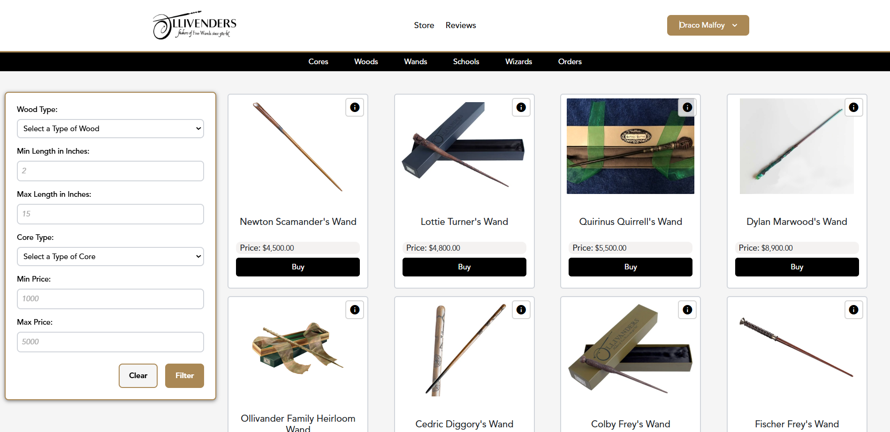
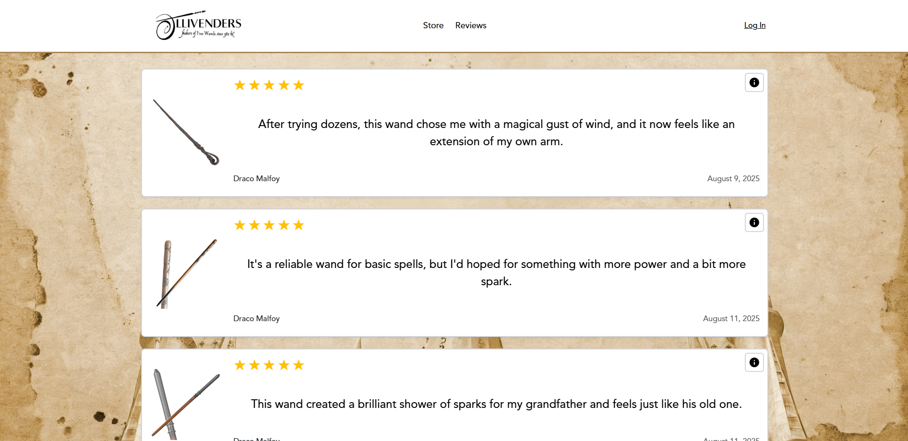
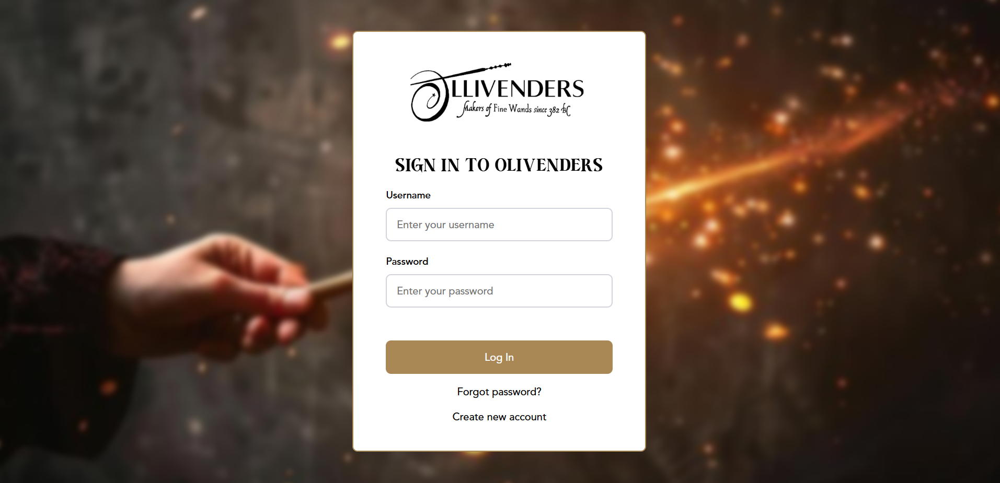
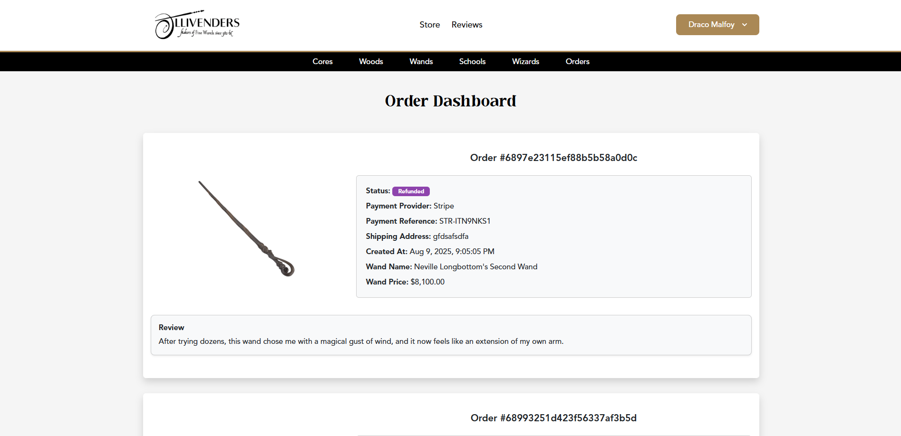
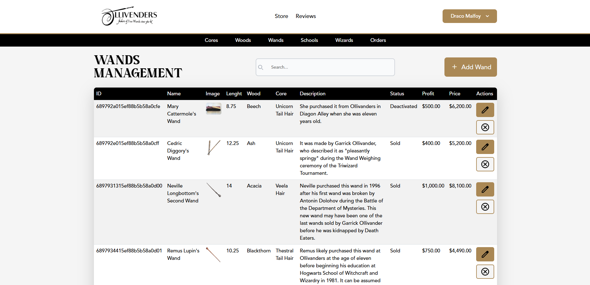

# Bienvenido a la Documentación de Olivenders
## Index
- [Propuesta de Proyecto](https://github.com/alejosilvalau/tp-dsw/blob/main/proposal.md)
- [Instrucciones para Ejecutar el Frontend Localmente](./setup.md)
- [Documentación de API y Backend](https://github.com/alejosilvalau/olivenders-backend/blob/main/README.md)
- [Reporte de Pruebas Realizadas](./tests.md)
- [Asignación De Tareas en Google Sheets](https://docs.google.com/spreadsheets/d/e/2PACX-1vRYG6wk1YdOS_V5gujWCNep1AQhlxPoENYRJxJguLItMrjZ1ZDrVIO5zwyHQJ-dzUpCSzZeI5BgxNNj/pubhtml)

## Capturas del Proyecto

